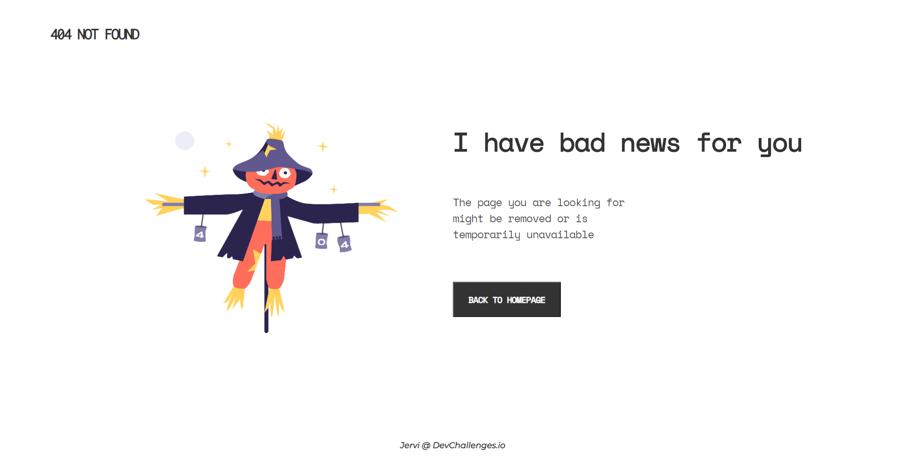
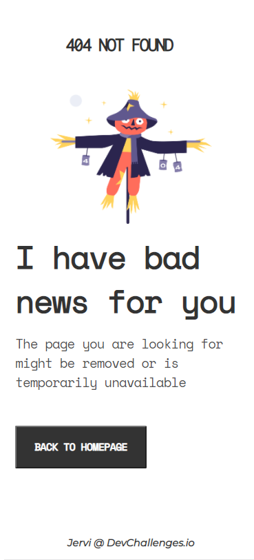

<!-- Please update value in the {}  -->

<h1 align="center">404 Not Found</h1>

   Solution for a challenge from  <a href="http://devchallenges.io" target="_blank">Devchallenges.io</a>.

  <h3>
    <a href="https://github.com/Jervi-sir/1-404-not-found">
      Solution
    </a>
     | 
    <a href="https://devchallenges.io/challenges/wBunSb7FPrIepJZAg0sY">
      Challenge
    </a>
     | 
    <a href="https://1-404-not-found-jervi.netlify.app/">
      Demo
    </a>
  </h3>

<!-- TABLE OF CONTENTS -->

## Table of Contents

- [Overview](#overview)
- [Built With](#built-with)
- [Features](#features)
- [Contact](#contact)
- [Acknowledgements](#acknowledgements)

<!-- OVERVIEW -->

## Overview

### Larger Screen 

___
### Phone's Screen

  

### Where can I see your demo

- You can click on the link her --> [Demo](https://devchallenges-404-not-found.ishakbhn.vercel.app/)

### What was your experience

- It didn't took alot of time, due to the help of preparing to strategies from the begining, of course that was after learning more about html and css from some ressources such as [LinkedIn](https://opportunity.linkedin.com/skills-for-in-demand-jobs). 
- The path went through designing for the Phone screen first then handeling the large screens, the font are set in "vh" size, the organization of elements are under Flex-boxes and Grids

### What have you learned/improved

- I finally put in work my knowledge, and faced some unespected issues during the process, and created a file only for new good font, not gonna lie the font that this challenge used was soo cool, anyways

### Built With

<!-- This section should list any major frameworks that you built your project using. Here are a few examples.-->

- [HTML](https://developer.mozilla.org/en-US/docs/Web/HTML)
- [CSS](https://developer.mozilla.org/en-US/docs/Glossary/CSS)

## Features

<!-- List the features of your application or follow the template. Don't share the figma file here :) -->

This application/site was created as a submission to a [DevChallenges](https://devchallenges.io/challenges) challenge. 

## Acknowledgements

<!-- This section should list any articles or add-ons/plugins that helps you to complete the project. This is optional but it will help you in the future. For exmpale -->

- [linkedIn Courses for basics](https://opportunity.linkedin.com/skills-for-in-demand-jobs)
- [Steps to replicate a design with only HTML and CSS](https://devchallenges-blogs.web.app/how-to-replicate-design/)
- [CSS Reset](https://dev.to/zellwk/my-css-reset--jbp?signin=true)
- [The Responsive Web Design Bootcamp](https://scrimba.com/learn/responsive)

## Contact

- GitHub   [@Jervi-sir](https://github.com/Jervi-sir)
- Facebook [Gacem_humen](https://www.facebook.com/gacem.humen/)
- Twitter  comingsoon
- Youtube  comingsoon

