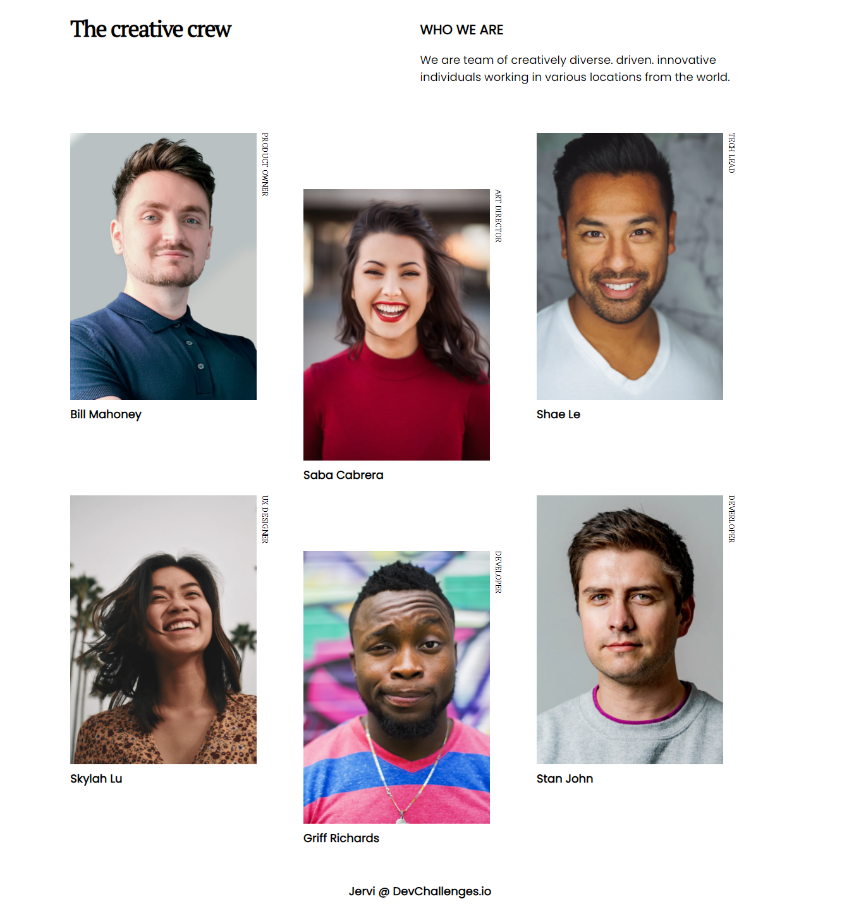
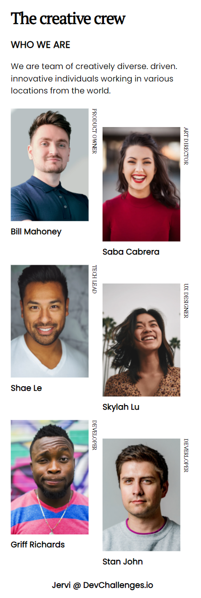

<!-- Please update value in the {}  -->

<h1 align="center">Team page</h1>

   Solution for a challenge from  <a href="http://devchallenges.io" target="_blank">Devchallenges.io</a>.

  <h3>
    <a href="https://2-team-page-jervi.netlify.app/">
      Demo
    </a>
     | 
    <a href="https://github.com/Jervi-sir/2-team-page-challenge">
      Solution
    </a>
     | 
    <a href="https://devchallenges.io/challenges/hhmesazsqgKXrTkYkt0U">
      Challenge
    </a>
  </h3>

<!-- TABLE OF CONTENTS -->

## Table of Contents

- [Overview](#overview)
  - [Built With](#built-with)
- [Features](#features)
- [Contact](#contact)
- [Acknowledgements](#acknowledgements)

<!-- OVERVIEW -->

## Overview

### Larger Screen

___
### phone's screen

### Story
-Everything went well, it was quick to do that by grids and flexbox . All tho , the process started from designing for phone screen, and then large screens

### Built With

<!-- This section should list any major frameworks that you built your project using. Here are a few examples.-->

- [html](https://www.w3schools.com/html/)
- [css](https://www.w3schools.com/css/)

## Features

<!-- List the features of your application or follow the template. Don't share the figma file here :) -->

This application/site was created as a submission to a [DevChallenges](https://devchallenges.io/challenges) challenge. The [challenge](https://devchallenges.io/challenges/hhmesazsqgKXrTkYkt0U) was to build an application to complete the given user stories.

## Acknowledgements

<!-- This section should list any articles or add-ons/plugins that helps you to complete the project. This is optional but it will help you in the future. For exmpale -->
- [html](https://www.w3schools.com/html/)
- [css](https://www.w3schools.com/css/)

## Contact

- Website notyet
- GitHub   [@Jervi-sir](https://github.com/Jervi-sir)
- Facebook [@Gacem_humen](https://facebook.com/gacem_humen)
