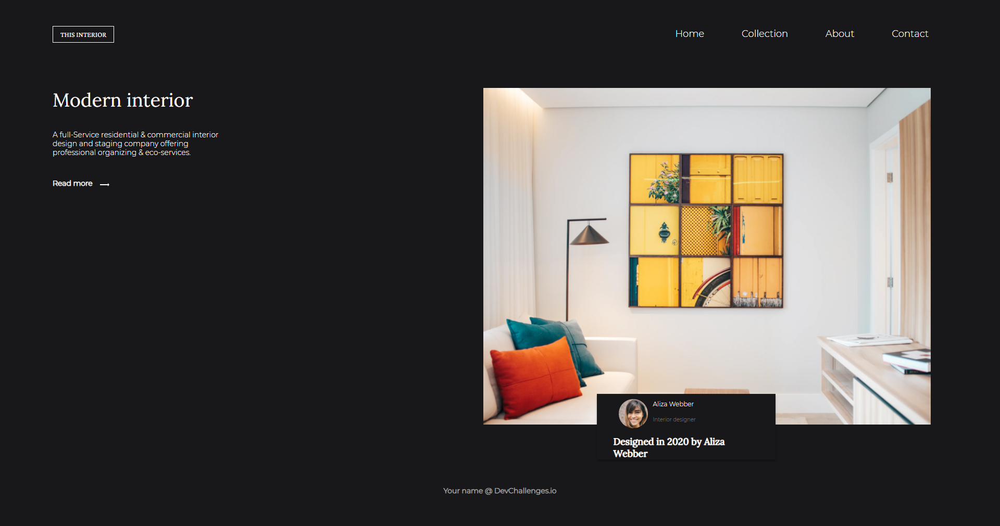
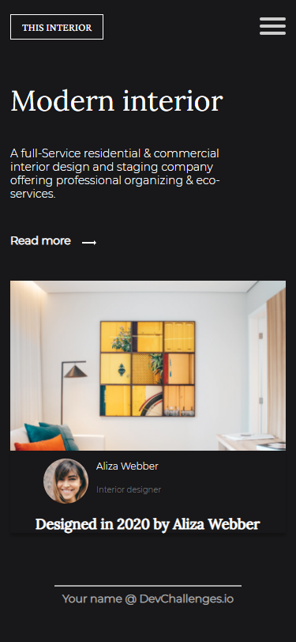

<!-- Please update value in the {}  -->

<h1 align="center">Interior Consultant</h1>

   Solution for a challenge from  <a href="http://devchallenges.io" target="_blank">Devchallenges.io</a>.

  <h3>
    <a href="https://github.com/Jervi-sir/3-interior-consultant">
      Solution
    </a>
     | 
    <a href="https://devchallenges.io/challenges/Jymh2b2FyebRTUljkNcb">
      Challenge
    </a>
     | 
    <a href="https://3-interior-consultant-jervi.netlify.app/">
      Demo
    </a>
  </h3>

<!-- TABLE OF CONTENTS -->

## Table of Contents

- [Overview](#overview)
- [Built With](#built-with)
- [Features](#features)
- [Contact](#contact)
- [Acknowledgements](#acknowledgements)

<!-- OVERVIEW -->

## Overview

### Larger Screen 

___
### Phone's Screen

  

### Where can I see your demo

- You can click on the link her --> [Demo](https://3-interior-consultant-jervi.netlify.app/)

### What was your experience
- Targeted firstly phone's screen, then large screen.
- I got some issues during responsive desiging, not for phone screen or large screen, but while resizing the viewport.

### What have you learned/improved

- Knew the flexbox and grids limitations , each modules got specific range.

### Built With

<!-- This section should list any major frameworks that you built your project using. Here are a few examples.-->

- [HTML](https://developer.mozilla.org/en-US/docs/Web/HTML)
- [CSS](https://developer.mozilla.org/en-US/docs/Glossary/CSS)

## Features

<!-- List the features of your application or follow the template. Don't share the figma file here :) -->

This application/site was created as a submission to a [DevChallenges](https://devchallenges.io/challenges) challenge. 

## Acknowledgements

<!-- This section should list any articles or add-ons/plugins that helps you to complete the project. This is optional but it will help you in the future. For exmpale -->

- [linkedIn Courses for basics](https://opportunity.linkedin.com/skills-for-in-demand-jobs)
- [Steps to replicate a design with only HTML and CSS](https://devchallenges-blogs.web.app/how-to-replicate-design/)
- [CSS Reset](https://dev.to/zellwk/my-css-reset--jbp?signin=true)
- [The Responsive Web Design Bootcamp](https://scrimba.com/learn/responsive)

## Contact

- GitHub   [@Jervi-sir](https://github.com/Jervi-sir)
- Facebook [Gacem_humen](https://www.facebook.com/gacem.humen/)
- Twitter  comingsoon
- Youtube  comingsoon

