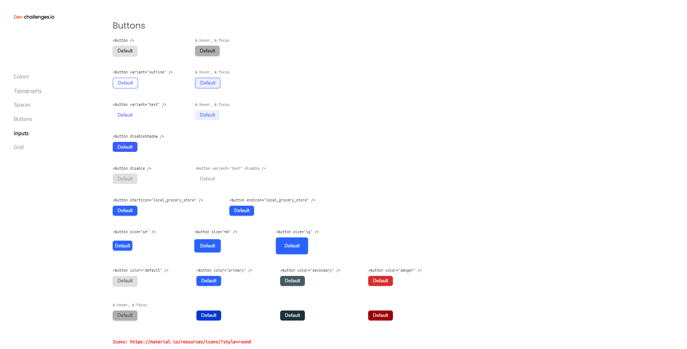

<!-- Please update value in the {}  -->

<h1 align="center">Button component</h1>

   Solution for a challenge from  <a href="http://devchallenges.io" target="_blank">Devchallenges.io</a>.

  <h3>
    <a href="https://9-button-component-jervi.netlify.app/">
      Demo
    </a>
     | 
    <a href="https://github.com/Jervi-sir/9-button-component">
      Solution
    </a>
     | 
    <a href="https://devchallenges.io/challenges/ohgVTyJCbm5OZyTB2gNY">
      Challenge
    </a>
  </h3>

<!-- TABLE OF CONTENTS -->

## Table of Contents

- [Overview](#overview)
  - [Built With](#built-with)
- [Features](#features)
- [How to use](#how-to-use)
- [Contact](#contact)

<!-- OVERVIEW -->

## Overview

### Larger Screen 
 

### Built With

<!-- This section should list any major frameworks that you built your project using. Here are a few examples.-->

- [HTML](https://developer.mozilla.org/en-US/docs/Web/HTML)
- [CSS](https://developer.mozilla.org/en-US/docs/Glossary/CSS)

## Features

<!-- List the features of your application or follow the template. Don't share the figma file here :) -->

This application/site was created as a submission to a [DevChallenges](https://devchallenges.io/challenges) challenge. The [challenge](https://devchallenges.io/challenges/ohgVTyJCbm5OZyTB2gNY) was to build an application to complete the given user stories.

## How To Use

<!-- This is an example, please update according to your application -->

Just download the files, 
copy the css file (style-system) in your project folder and include it (the project isn't finished yet)
also include link for [Material icons]  (https://fonts.googleapis.com/icon?family=Material+Icons)

## Contact

- GitHub   [@Jervi-sir](https://github.com/Jervi-sir)
- Facebook [Gacem_humen](https://www.facebook.com/gacem.humen/)
- Twitter  comingsoon
- Youtube  comingsoon

